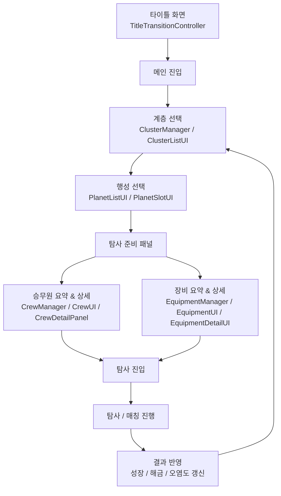

```mermaid
flowchart TD
    A[타이틀 화면<br/>TitleTransitionController] --> B[메인 진입]
    B --> C[계층 선택<br/>ClusterManager / ClusterListUI]
    C --> D[행성 선택<br/>PlanetListUI / PlanetSlotUI]
    D --> E[탐사 준비 패널]
    E --> F[승무원 요약 & 상세<br/>CrewManager / CrewUI / CrewDetailPanel]
    E --> G[장비 요약 & 상세<br/>EquipmentManager / EquipmentUI / EquipmentDetailUI]
    F --> H[탐사 진입]
    G --> H
    H --> I[탐사 / 매칭 진행]
    I --> J[결과 반영<br/>성장 / 해금 / 오염도 갱신]
    J --> C
```
