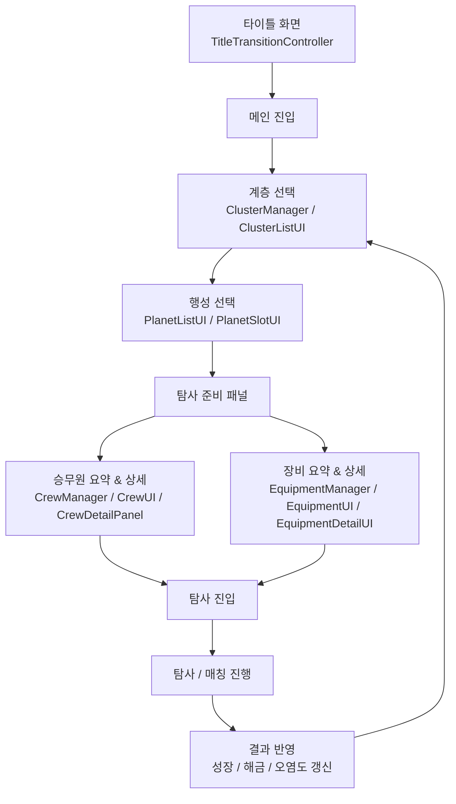

# Project NOVA - UI·Growth System Technical Document

> 2D 방치형 우주 탐사 RPG **Project NOVA**에서 담당한 UI 흐름, 성장 시스템, 장비·승무원 상태 관리, 타이틀 전환 연출을 정리한 기술 문서입니다.

---

## 1. 프로젝트 개요

**Project NOVA**는 행성을 탐사하고, 자원을 수집하며, 승무원과 장비를 성장시켜 다음 행성으로 나아가는 2D 방치형 우주 탐사 RPG입니다.

플레이어는 탐사 전 화면에서 현재 행성 상태, 승무원 성장 상태, 장비 제작·강화 상태를 확인하고 탐사에 진입합니다.
이 과정에서 중요한 목표는 단순히 버튼을 배치하는 것이 아니라, **튜토리얼 없이도 플레이어가 현재 상태와 다음 목표를 이해할 수 있는 UI 흐름**을 만드는 것이었습니다.

---

## 2. 담당 범위

| 구분       | 담당 내용                                          |
| -------- | ---------------------------------------------- |
| 장비 시스템   | 장비 제작, 강화, 티어업, 해금 조건, 현재 효과 및 다음 효과 표시        |
| 장비 UI    | 장비 선택 슬롯, 상세 패널, 요약 카드, 잠금/미제작/강화/MAX 상태 분기    |
| 승무원 시스템  | 승무원 레벨업, 등급 업그레이드, 역할별 해금 조건, 보너스 효과 관리        |
| 승무원 UI   | 승무원 카드, 상세 패널, 해금 VFX, 선택 피드백, 잠금/해금 상태 표시     |
| 행성 선택 UI | 계층별 행성 슬롯 구성, 행성 해금 조건, 선택 상태, 오염도 표시          |
| 타이틀 연출   | 시작 버튼 클릭 후 암전, 문 연출, 웜홀, 워프, 플래시, 로그인 팝업 흐름 구현 |

---

## 3. UI Flow



### UI 흐름 설명

1. **타이틀 화면**

   * 시작 버튼 클릭 시 타이틀 전환 연출 시작
   * 암전, 문 연출, 웜홀, 워프, 플래시 이후 로그인 팝업 표시

2. **계층·행성 선택**

   * 현재 계층의 행성 목록 표시
   * 이전 행성의 코어 진행도가 100% 이상이면 다음 행성 해금
   * 선택된 행성의 코어 진행도와 오염도 상태를 UI에 반영

3. **탐사 준비 패널**

   * 탐사 전 승무원과 장비 상태를 요약 표시
   * 플레이어가 현재 전력과 성장 상태를 확인한 뒤 탐사에 진입할 수 있도록 구성

4. **승무원 상세 UI**

   * 승무원 레벨, 등급, 현재 효과, 다음 효과, 업그레이드 조건 표시
   * 잠긴 승무원은 잠금 상태와 해금 조건을 표시

5. **장비 상세 UI**

   * 장비의 잠김, 미제작, 제작 완료, 강화 가능, 최고 레벨, 티어업 가능 상태를 분기
   * 제작 비용, 강화 비용, 현재 효과, 다음 효과를 표시

---

## 4. 핵심 구현 1 - 장비 성장 시스템

### 목표

장비 시스템은 단순한 강화 버튼이 아니라, 플레이어가 다음 성장 목표를 이해하도록 만드는 것이 중요했습니다.

따라서 장비 상태를 아래처럼 분리했습니다.

| 상태        | UI 표시             |
| --------- | ----------------- |
| 잠김        | 해금 조건 표시          |
| 해금됨 / 미제작 | 제작 비용과 제작 후 효과 표시 |
| 제작 완료     | 현재 효과와 강화 비용 표시   |
| 최고 레벨     | MAX 상태 표시         |
| 티어 상승 가능  | 다음 티어 진입 가능 상태 표시 |

### 관련 코드

* `EquipmentManager.cs`
* `EquipmentUI.cs`
* `EquipmentDetailUI.cs`
* `EquipmentSelectSlot.cs`
* `EquipmentSummaryCardUI.cs`

### 구현 포인트

* `EquipmentManager`에서 장비별 제작 여부, 레벨, 활성 티어를 관리했습니다.
* 장비 타입별 ScriptableObject 배열을 사용해 노말, 레어, 에픽 데이터를 분리했습니다.
* 현재 계층의 요구 장비 등급에 따라 하위 티어 장비에는 패널티를 적용할 수 있도록 구성했습니다.
* 장비 제작, 강화, 해금 이벤트 발생 시 UI가 자동 갱신되도록 EventManager 기반 구조를 사용했습니다.

### 코드 링크

* [EquipmentManager.cs](docs/project-nova/src/project-nova/Equipment/EquipmentManager)
* [EquipmentUI.cs](../../src/project-nova/Equipment/EquipmentUI.cs)
* [EquipmentDetailUI.cs](../../src/project-nova/Equipment/EquipmentDetailUI.cs)
* [EquipmentSelectSlot.cs](../../src/project-nova/Equipment/EquipmentSelectSlot.cs)

---

## 5. 핵심 구현 2 - 승무원 성장 UI

### 목표

승무원 시스템은 역할별 성장과 해금 조건을 명확하게 보여주는 것이 중요했습니다.

플레이어가 아직 사용할 수 없는 승무원도 “왜 잠겨 있는지”, “무엇을 달성하면 해금되는지” 알 수 있도록 잠금 상태와 상세 정보를 분리했습니다.

### 관련 코드

* `CrewManager.cs`
* `CrewUI.cs`
* `CrewDetailPanel.cs`
* `CrewCardGroup.cs`
* `CrewCardSelector.cs`

### 구현 포인트

* `CrewManager`에서 승무원별 레벨, 등급, 해금 조건을 관리했습니다.
* 엔지니어는 기본 해금, 탐사자는 엔지니어 Lv.10, 보안요원은 탐사자 Lv.10 달성 시 해금되도록 구성했습니다.
* `CrewUI`는 잠금/해금 상태에 따라 캐릭터 이미지, 버튼 활성화, 요약 보너스를 분기했습니다.
* `CrewDetailPanel`은 현재 효과, 다음 효과, 다음 업그레이드 조건, 레벨업 비용, 업그레이드 비용을 분리해서 표시했습니다.
* 해금 시 VFX와 사운드를 연결해 성장 피드백을 강화했습니다.

### 코드 링크

* [CrewManager.cs](../../src/project-nova/Crew/CrewManager.cs)
* [CrewUI.cs](../../src/project-nova/Crew/CrewUI.cs)
* [CrewDetailPanel.cs](../../src/project-nova/Crew/CrewDetailPanel.cs)

---

## 6. 핵심 구현 3 - 행성·계층 선택 UI

### 목표

행성 선택 UI는 플레이어가 현재 탐사 가능한 행성과 다음 목표를 바로 이해할 수 있도록 만드는 것이 목표였습니다.

행성이 잠겨 있을 때 단순히 비활성화하는 것이 아니라, 어떤 행성을 복구해야 다음 행성이 열리는지 표시했습니다.

### 관련 코드

* `ClusterManager.cs`
* `ClusterListUI.cs`
* `ClusterSlotUI.cs`
* `PlanetListUI.cs`
* `PlanetSlotUI.cs`

### 구현 포인트

* `ClusterManager`는 현재 계층과 행성 진행 상태를 관리합니다.
* `PlanetListUI`는 현재 계층의 행성 목록을 슬롯에 배치하고, 이전 행성 코어 진행도가 100% 이상이면 다음 행성을 해금합니다.
* `PlanetSlotUI`는 잠김/해금 상태, 행성 이름, 코어 진행도, 오염도 게이지를 표시합니다.
* 선택된 행성은 Outline과 Pulse 피드백으로 강조했습니다.
* 매칭 상태에서는 행성 선택을 잠가 잘못된 입력을 방지했습니다.

### 코드 링크

* [ClusterManager.cs](../../src/project-nova/Planet/ClusterManager.cs)
* [PlanetListUI.cs](../../src/project-nova/Planet/PlanetListUI.cs)
* [PlanetSlotUI.cs](../../src/project-nova/Planet/PlanetSlotUI.cs)

---

## 7. 핵심 구현 4 - 타이틀 전환 연출

### 목표

Project NOVA는 우주 탐사 콘셉트의 게임이기 때문에, 첫 진입 화면에서 분위기를 전달하는 것이 중요하다고 판단했습니다.

기능 명세에 없던 타이틀 전환 연출을 추가해, 플레이어가 시작 버튼을 누른 직후부터 우주 탐사 분위기를 느낄 수 있도록 구성했습니다.

### 연출 흐름

```mermaid
sequenceDiagram
    participant Player
    participant Title
    participant Transition
    participant Login

    Player->>Title: Start Button Click
    Title->>Transition: BGM Fade Out / SFX Play
    Transition->>Transition: Dark Fade
    Transition->>Transition: Door Tease
    Transition->>Transition: Wormhole Appear
    Transition->>Transition: Door Open
    Transition->>Transition: Enter Wormhole
    Transition->>Transition: Warp Acceleration
    Transition->>Transition: White Flash
    Transition->>Login: Open Login Popup
```

### 관련 코드

* `TitleTransitionController.cs`

### 구현 포인트

* Coroutine 기반으로 연출 단계를 순차 실행했습니다.
* CanvasGroup을 사용해 타이틀, 문, 웜홀, 워프, 흰색 플래시의 알파와 입력 가능 상태를 제어했습니다.
* 시작 버튼 클릭 후 중복 입력을 방지하기 위해 `isTransitioning` 상태를 사용했습니다.
* 스킵 버튼을 제공해 반복 시청에 대한 피로도를 줄였습니다.
* BGM Fade Out과 SFX 재생을 연결해 시작 피드백을 강화했습니다.

### 코드 링크

* [TitleTransitionController.cs](../../src/project-nova/Title/TitleTransitionController.cs)

---

## 8. 문제 해결 포인트

### 8-1. UI 상태가 복잡해지는 문제

장비와 승무원 UI는 단순히 활성/비활성만으로 표현하기 어려웠습니다.

장비는 잠김, 미제작, 제작 완료, 강화 가능, 최고 레벨, 티어업 가능 상태가 있었고, 승무원은 잠김, 해금, 레벨업 가능, 업그레이드 가능, 최고 등급 상태가 있었습니다.

이를 해결하기 위해 상태별 Refresh 메서드를 분리하고, Manager에서 계산한 상태를 UI가 받아 표시하는 방식으로 구조를 나누었습니다.

---

### 8-2. 유저가 다음 목표를 이해하기 어려운 문제

방치형 성장 게임에서는 유저가 현재 상태와 다음 목표를 쉽게 파악해야 합니다.

이를 위해 장비 UI에서는 해금 조건, 제작 비용, 현재 효과, 다음 효과를 명확하게 분리했고, 승무원 UI에서는 다음 업그레이드 해금 레벨과 현재 보너스를 함께 표시했습니다.

또한 탐사 준비 화면에서는 승무원과 장비 상태를 요약해 탐사 전 세팅 상태를 한눈에 확인할 수 있도록 구성했습니다.

---

### 8-3. 첫 진입 몰입감이 부족한 문제

기본적인 타이틀 화면만으로는 우주 탐사 게임의 분위기를 충분히 전달하기 어렵다고 판단했습니다.

그래서 시작 버튼 클릭 이후 암전, 문 연출, 웜홀, 워프, 플래시로 이어지는 전환 시퀀스를 구성했습니다.

이 연출은 단순한 장식이 아니라, 플레이어가 “우주 탐사에 진입한다”는 느낌을 받을 수 있도록 하는 첫 피드백 역할을 합니다.

---

## 9. 결과

* 승무원, 장비, 행성 상태를 탐사 준비 흐름 안에서 확인할 수 있도록 UI 구조를 정리했습니다.
* 잠금/해금/성장 상태를 분리해 플레이어가 현재 상태와 다음 목표를 이해할 수 있도록 구성했습니다.
* 기능 명세에 없던 타이틀 전환 연출을 추가해 첫 진입 몰입감을 강화했습니다.
* Manager와 UI 역할을 분리해 기능 수정 시 영향을 줄일 수 있도록 구조화했습니다.

---

## 10. 사용 기술

* Unity
* C#
* TextMeshPro
* Coroutine
* CanvasGroup
* ScriptableObject
* EventManager 기반 UI 갱신
* DOTween 일부 사용
* Git / GitHub / UVCS

---

## 11. 시연 자료

> 아래 자료는 추후 추가 예정입니다.

* 타이틀 전환 연출 GIF
* 장비 제작·강화 UI GIF
* 승무원 해금·업그레이드 UI GIF
* 탐사 준비 UI Flow 이미지
* 전체 시연 영상

---

## 12. 회고

Project NOVA를 진행하며 UI는 단순히 정보를 보여주는 화면이 아니라, 플레이어가 현재 상태와 다음 목표를 이해하도록 돕는 구조라는 것을 배웠습니다.

특히 방치형 성장 게임에서는 “무엇을 눌러야 하는가”보다 “왜 눌러야 하는가”를 전달하는 것이 중요했습니다.

앞으로도 기능 구현에만 머무르지 않고, 유저가 기능을 어떻게 이해하고 받아들이는지까지 고려하는 클라이언트 개발자가 되고자 합니다.
